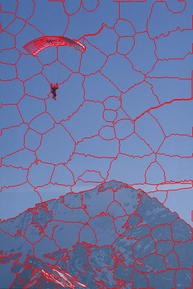
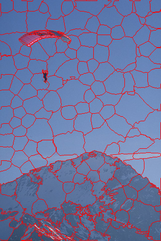
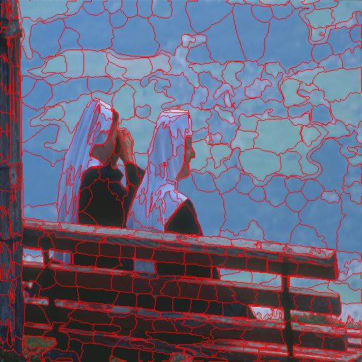
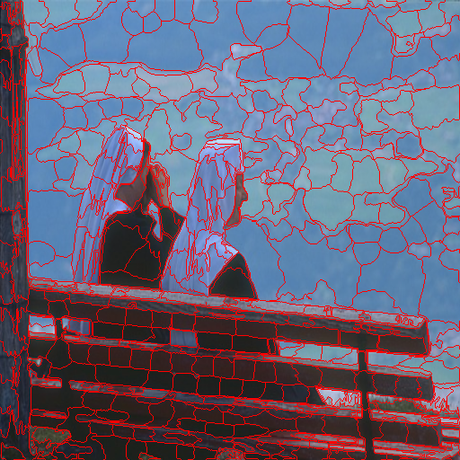
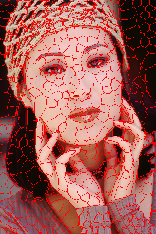
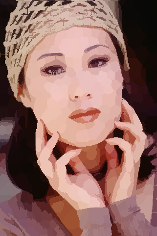
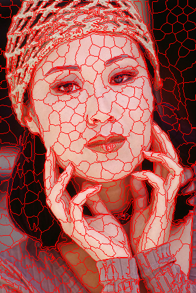

# Bayesian Adaptive Superpixel Segmentation

This is the official code for our ICCV 2019 paper, ["Bayesian Adaptive Superpixel Segmentation"](https://www.cs.bgu.ac.il/~orenfr/BASS/Uziel_ICCV_2019.pdf) , co-authored by Roy Uziel, Meitar Ronen, and Oren Freifeld.

#### Important update (12/3/2021). The original GPU code (from the time of the publication of the paper) has been deprecated. The current code is based on a much faster CUDA implementation, translating usually to a x50 speedup. 

# Prerequisites
GPU 
CUDA driver (Tested on 11.3+)
OpenCV 

# Installation

### Cloning The GitHub Repository

```bash
$ git clone https://github.com/BGU-CS-VIL/BASS.git
``` 
```bash
$ cd BASS
$ mkdir build
$ cd build
$ cmake .. && make
``` 

# Usage
```bash
$./Sp_demo_for_direc -d ../images
``` 
Mean and contours images will be saved at ../result alongside the segmentation map (csv)

### Args and Kwargs:
-n the desired number of pixels on the side of a superpixel
-i_std std dev for color Gaussians, should be 0.01<= value <=0.05. A smaller value leads to more irregular superpixels
--im_size resizing input images (single number)
--beta beta (Potts) 0 < value < 10
--alpha alpha (Hasting ratio) 0.01< value <100

### Usage Examples:

#### Changing the initial number of Superpixels:
```bash
./Sp_demo_for_direc -d ../images -n 25
```
 


```bash
./Sp_demo_for_direc -d ../images -n 15
```



#### Larger Values of alpha will result in more superpixels due to splits:
```bash
./Sp_demo_for_direc -d ../images/ --im_size 512 -n 20 --alpha 0.1
```



```bash
./Sp_demo_for_direc -d ../images/ --im_size 512 -n 20 --alpha 20
```



#### Increasing i_std will result in more compact Superpixels:

```bash
./Sp_demo_for_direc -d ../images/ --i_std 0.03
```
  

```bash
./Sp_demo_for_direc -d ../images/ --i_std 0.018
```

  


This software is released under the MIT License (included with the software). Note, however, that if you are using this code (and/or the results of running it) to support any form of publication (e.g., a book, a journal paper, a conference paper, a patent application, etc.) then we request you will cite our paper:

```
@inproceedings{Uziel:ICCV:2019:BASS,
  title = {Bayesian Adaptive Superpixel Segmentation},
  author = {Roy Uziel and Meitar Ronen and Oren Freifeld},
  booktitle = {ICCV},
  year={2019}
 } 
